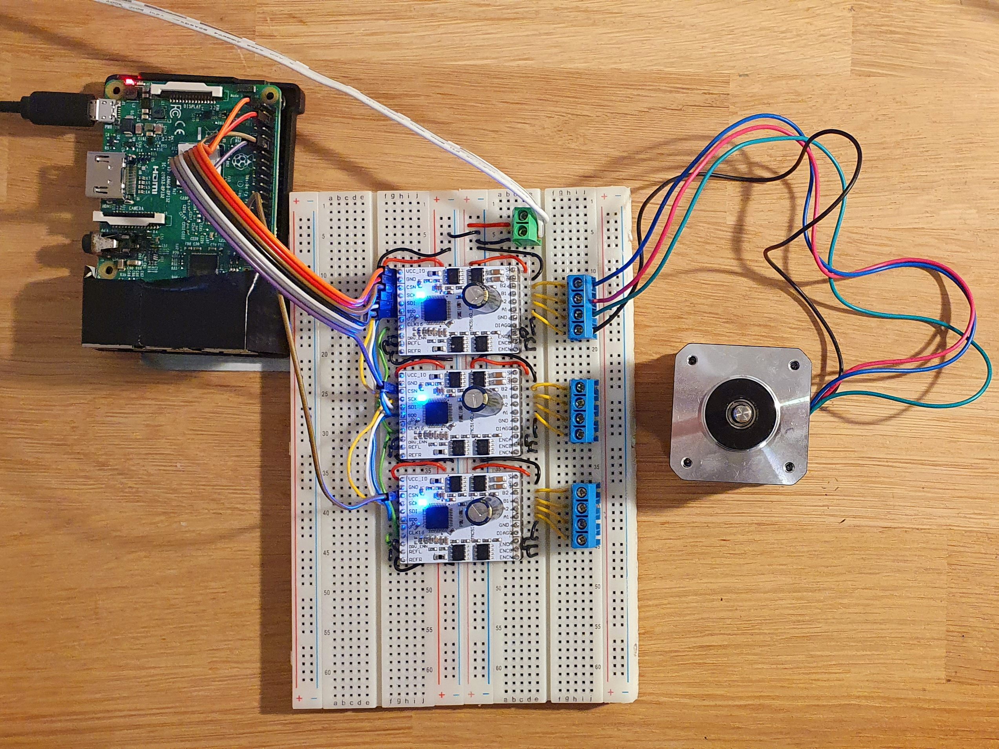

# pimoco
Telescope mount and focuser control with a Raspberry Pi 


## Motivation

Why do we need a separate device to control stepper motors attached to a telescope? Often times, a Raspberry Pi 4 running Ekos/Kstars/Indi will be attached to the telescope anyway, providing plenty of compute power. Modern stepper motor controllers like the Trinamic TMC5160 have an on-board motion controller which accepts position read, set target speed and go-to commands via SPI. The Raspberry Pi has two such interfaces for a total of five devices on its GPIO port, and can generate the necessary clock signals via hardware PCM.

This is 
* robust (no Wifi, Bluetooth or USB connections to the mount as a source of error)
* beautiful (supports SkySafari on phones/tablets and game controllers via Ekos/Kstars/Indi) 
* inexpensive (no need for separate microcontrollers like OnStep or TeenAstro)
* manageable (no separate device firmware, only Indi drivers which Linux package managers can update)    


## References

* [Trinamic TMC5160 Datasheet](https://www.trinamic.com/fileadmin/assets/Products/ICs_Documents/TMC5160A_Datasheet_Rev1.14.pdf)
* [Trinamic TMC5160-BOB Breakout Board](https://www.trinamic.com/fileadmin/assets/Products/Eval_Documents/TMC5160-BOB_datasheet_rev1.10.pdf)
* [Raspberry Pi 4 SOC Datasheet BCM2711](https://www.raspberrypi.org/documentation/hardware/raspberrypi/bcm2711/rpi_DATA_2711_1p0.pdf)
* [Raspberry Pi GPIO](https://www.raspberrypi.org/documentation/hardware/raspberrypi/gpio/README.md)
* [Raspberry Pi SPI](https://www.raspberrypi.org/documentation/hardware/raspberrypi/spi/README.md)
* [Indi Github](https://github.com/indilib/indi)
* [libnova Sourceforge](http://libnova.sourceforge.net/)


## Digikey parts list

Apart from a Raspberry Pi 4 (get the 8 GB model just in case you want to run live stacking etc), here are the parts you will need:

| Vendor item    | Digikey item | Name                            | Quantity |
|----------------|--------------|---------------------------------|---------:|
| TMC5160-BOB    | 1460-1250-ND | BREAKOUTBOARD WITH TMC5160      |        3 |
| EEU-FC1J151    | P10344-ND    | CAP ALUM 150UF 20% 63V RADIAL   |        3 |
| DLS1XS5AK40X   | 626-1561-ND  | CONN D-SUB RCPT 9POS R/A SLDR   |        3 |
| PJ-037AH       | CP-037AH-ND  | CONN PWR JACK 2X5.5MM SOLDER    |        1 |
| PJ-002BH       | CP-002BH-ND  | CONN PWR JACK 2.5X5.5MM SOLDER  |        1 |
| 4527           | 36-4527-ND   | FUSE HLDR CARTRIDGE 250V 5A PCB |        1 |
| 0217005.HXP    | F2395-ND     | FUSE GLASS 5A 250VAC 5X20MM     |        1 |
| 100SP1T2B4M6QE | EG2362-ND    | SWITCH TOGGLE SPDT 5A 120V      |        1 |
| SB540          | SB540FSCT-ND | DIODE SCHOTTKY 40V 5A DO201AD   |        1 |
| PPTC202LFBN-RC | S6104-ND     | CONN HDR 40POS 0.1 TIN PCB      |        1 | 

Optional Ublox Neo6M GPS breakout board, e.g. the Chinese GY-GPS6MV2.

## Hardware setup



| Device connection            | Function            |Header|Pin| Function            | Device connection           |
|-----------------------------:|--------------------:|-----:|--:|---------------------|-----------------------------|
| TMC5160 dev 0,1,2 & GPS VCC_IO | 3.3v Power          |     1|  2| 5v Power            | N.c.                        |
| N.c.                         | GPIO  2 I2C1 SDA    |     3|  4| 5v Power            | N.c.                        |
| N.c.                         | GPIO  3 I2C1 SCL    |     5|  6| Ground              | TMC5160 devices 0,1,2 & GPS GND   |
| TMC5160 devices 0,1,2 CLK16  | GPCLK0              |     7|  8| GPIO 14 UART0 TX    | GPS Rx                      |
| N.c.                         | Ground              |     9| 10| GPIO 15 Uart0 RX    | GPX Tx                      |
| TMC5160 device 1 CSN         | GPIO 17 SPI1 CE1    |    11| 12| GPIO 18 SPI1 CE0    | TMC5160 device 0 CSN        |
| TMC5160 device 0 DIAG0       | GPIO 27             |    13| 14| Ground              | N.c.                        |
| TMC5160 device 1 DIAG0       | GPIO 22             |    15| 16| GPIO 23             | TMC5160 device 2 DIAG0      |
| N.c.                         | 3v3 Power           |    17| 18| GPIO 24             | N.c.                        |
| N.c.                         | GPIO 10 SPI0 MOSI   |    19| 20| Ground              | N.c.                        |
| N.c.                         | GPIO  9 SPI0 MISO   |    21| 22| GPIO 25             | N.c.                        |
| N.c.                         | GPIO 11 SPI0 SCLK   |    23| 24| GPIO  8 SPI0 CE0    | N.c.                        |
| N.c.                         | Ground              |    25| 26| GPIO  7 SPI0 CE1    | N.c.                        |
| N.c.                         | GPIO  0 EEPROM SDA  |    27| 28| GPIO  1 EEPROM SCL  | N.c.                        |
| N.c.                         | GPIO  5             |    29| 30| Ground              | N.c.                        |
| N.c.                         | GPIO  6             |    31| 32| GPIO 12 PWM0 4(alt0)| N.c.                        |
| N.c.                         | GPIO 13 PWM1 4(alt0)|    33| 34| GPIO 16             | N.c.                        |
| TMC5160 devices 0,1,2 SDO    | GPIO 19 SPI1 MISO   |    35| 36| GPIO 16 SPI1 CE2    | TMC5160 device 2 CSN        |
| N.c.                         | GPIO 26             |    37| 38| GPIO 20 SPI1 MOSI   | TMC5160 devices 0,1,2 SDI   |
| N.c.                         | Ground              |    39| 40| GPIO 21 SPI1 SCLK   | TMC5160 devices 0,1,2 SCK   | 

N.c. = Not connected


## Software setup

Edit the boot configuration with `sudo nano /boot/config.txt` and add the following lines at the end:

```
# Enable three SPI channels on SPI1 with standard pins for the
# pimoco telescope mount and focuser controller
dtoverlay=spi1-3cs
```

Edit the runlevel configuration with `sudo nano /etc/rc.local` and add the following lines just before the final `exit 0` line:

```
# Output a 9.6 MHz clock on physical pin 7 (GPCLK0) for the 
# pimoco telescope mount and focuser controller
gpio -1 mode 7 alt0
gpio -1 clock 7 9600000
```

Install the Indi driver development environment and Nova library with `sudo apt-get install libindi-dev libnova-dev`.

Build with `make`.

Run standalone test with `make test` or `./test_stepper`.

Run an Indi server testbed with `make serve` or `indiserver -v ./indi_pimoco_focuser ./indi_pimoco_mount`.


## Software setup for optional GPS

For GPS, first get the serial port working. Open `sudo raspi-config`, go to the interfaces section, and enable the serial port but disable the serial console. Reboot. Set the speed with `stty -F /dev/ttyS0 9600`. Verify you are getting some data with `minicom -b -D /dev/ttyS0`.

Then stop virtualgps, which comes preinstalled on Astroberry. `sudo systemctl disable virtualgps` and `sudo systemctl stop virtualgps`.

Finally get the gps daemon in shape. On Astroberry, the programs are preinstalled. If they are missing, do `sudo apt-get install gpsd gpsd-clients`. Edit `/etc/default/gpsd` and set `DEVICES="/dev/ttyS0". Restart gpsd with `sudo /etc/init.d/gpsd restart`. Check everything works with `cgps`. 

